<!--
╔═══════════════════════════════════════════════════════════════╗
║  GITHUB PROFILE README  —  Nyan Cat Edition                   ║
║  ─────────────────────────────────────────────────────────── ║
║  SETUP (one-time):                                            ║
║  1. Create repo:  github.com/new  →  name = YOUR USERNAME     ║
║  2. Upload this README.md + nyan-cat.svg to the repo root     ║
║  3. Replace every "YOUR_USERNAME" below with your username    ║
║  4. Edit the two lines in nyan-cat.svg marked "EDIT BELOW"   ║
║                                                               ║
║  LIVE STATS explained:                                        ║
║  • github-readme-stats  →  commits, stars, PRs, issues       ║
║  • github-readme-streak-stats → current / longest streak     ║
║  • shields.io badge     →  repo count                        ║
║                                                               ║
║  All widgets update automatically — no action needed.         ║
╚═══════════════════════════════════════════════════════════════╝
-->

  

<!-- ── LIVE STAT BADGES (auto-updated) ───────────────────────────
     Replace YOUR_USERNAME with your GitHub username in every URL. -->

  <!-- Total commits (all years) -->
  

  <!-- Followers -->
  

  <!-- Stars across all repos -->
  

---

## 👾 About Me

- 🔭 Currently working on ... Machine Learning Theory / Artificial Intelligence
- 🌱 Learning ... Neural Network Robustness
- 💬 Ask me about ... Computational Mathematics / Theoretical CS
- 📫 Reach me at ...dayeon603@gmail.com

---

<!-- ── GITHUB STATS CARD (commits, PRs, issues, stars) ──────────
     Themes: dark | radical | merko | gruvbox | tokyonight | onedark
     Change &theme=dark to any theme above.                        -->
## 📊 GitHub Stats

  

  

<!-- ── STREAK STATS (current streak, longest streak, total contribs) -->

  

<!-- ── CONTRIBUTION GRAPH ──────────────────────────────────────── -->

  

---

